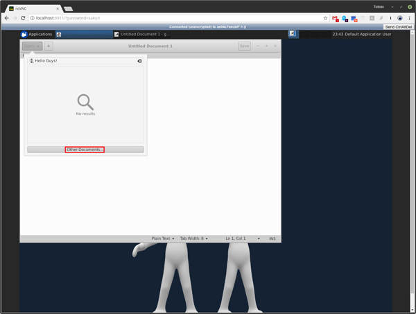
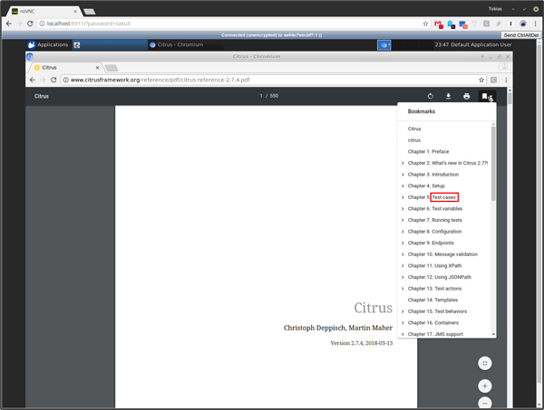

# Sakuli Selenium Integration Example

This is an example Project-Setup to integrate [Selenium](https://www.selenium.org) with your Sakuli Tests.

Chrome Driver: https://sites.google.com/a/chromium.org/chromedriver/downloads
Firefox Driver (geckodriver): https://github.com/mozilla/geckodriver/releases

**General note:** If you get the exception `java.nio.file.AccessDeniedException: /opt/test/example_xfce/_logs` please ensure that you local files have the correct file permissions. If you not sure you can run `chmod a+rw -R .` or change `user: 1000` to your own user id (execute `id -u`).

## Use Case

Extend your current Selenium test with native screenbased testing like [Sakuli](http://consol.github.io/sakuli/latest/index.html#concept).
 
 **Native OS specific Test: [`OsNativeTest.java`](./src/test/java/org/sakuli/example/uiOnly/OsNativeTest.java)**
 
  
 
 **Web + Native PDF specific Test: [`CitrusHtmlPdfTest.java`](./src/test/java/org/sakuli/example/citrus/CitrusHtmlPdfTest.java)**
 
 
 
 With [Sakuli Se](http://consol.github.io/sakuli/latest/index.html#sakuli-se) extension you can also forwad your results to monitoring system like [OMD (nagios)](http://consol.github.io/sakuli/latest/index.html#omd-gearman), [Icinga2](http://consol.github.io/sakuli/latest/index.html#icinga2-integration), [check_mk](http://consol.github.io/sakuli/latest/index.html#check_mk).

## Build & Run & debug tests in Docker container

To run the example direct in a docker container you can execute the following command. Then you can control the testcases through the `bash` console. To connect on the embedded UI open: [`http://localhost:6911/?password=sakuli`](http://localhost:6911/?password=sakuli) 

     docker build -t local/sakuli-se . \
        && docker run -it \
        -v $(pwd):/opt/maven -v ~/.m2:/headless/.m2 \
        -p 5911:5901 -p 6911:6901 \
        local/sakuli-se bash

To run the whole testsuite you simple execute:

    mvn -P docker test

To run a specific test you use the maven option `-Dtest=MyTest*`

    mvn -P docker test -Dtest=GitHub*
    
## Docker Compose Setup

To use a more comfortable setup user [Docker Compose]():

    docker-compose up --build --force-recreate